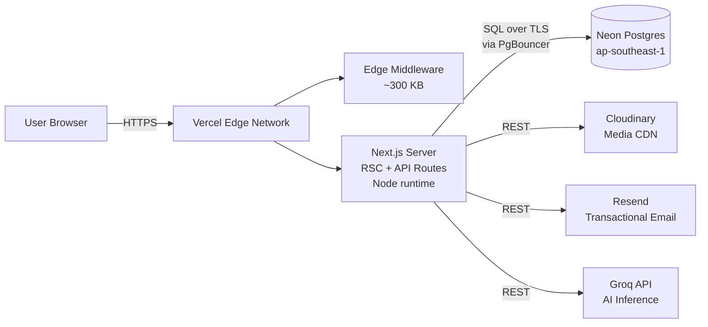
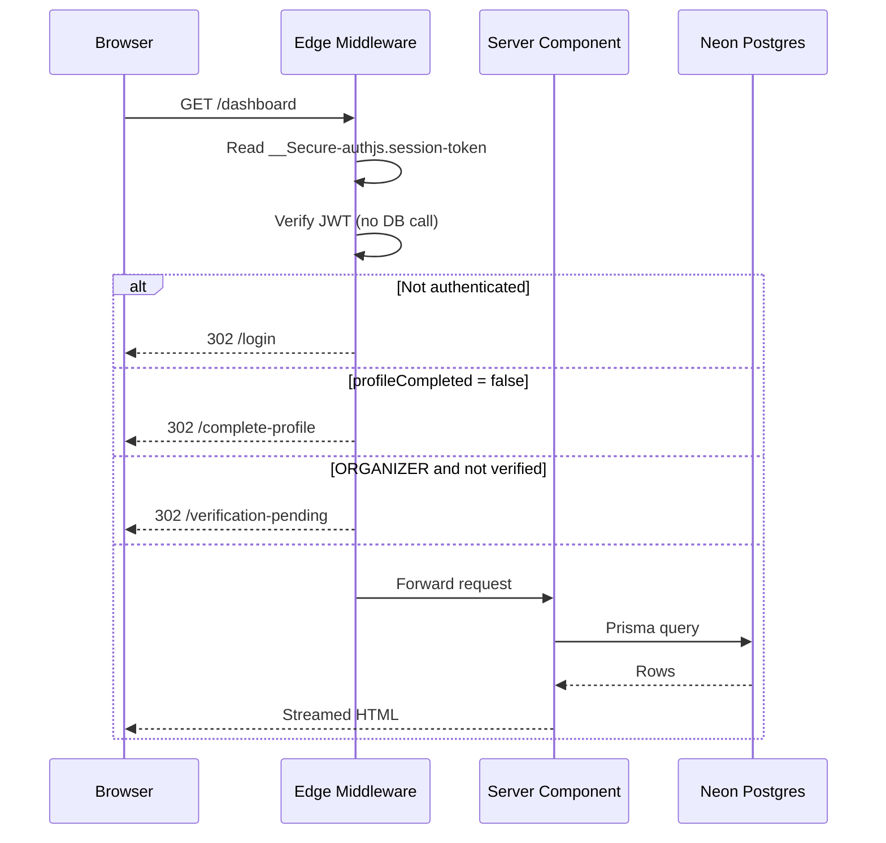
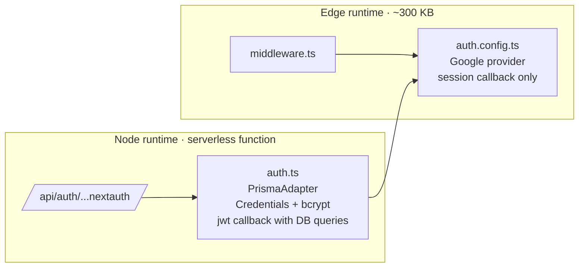

# EventEase

**A multi-tenant event lifecycle platform for higher-education institutions.**

From event creation and approval through registration, QR-based attendance, certificate issuance, and community discussion — unified in a single role-aware system.

**[Live demo →](https://event-ease-sage.vercel.app)**

---

## Overview

EventEase models the complete operational flow of running events at a college: organizers create and publish events, students discover and register, attendance is captured at the door via QR, certificates are issued post-event, and announcements flow back to the community.

The system is **multi-tenant by design** — colleges (`Organization`s) are auto-provisioned from the email domain of the first user to sign up. Onboarding a new institution requires zero manual configuration.

Built as a single Next.js application backed by serverless PostgreSQL, deployed on Vercel + Neon, with media on Cloudinary and transactional email through Resend.

## Highlights

- **Multi-tenant by default.** Colleges auto-provision from email-domain mapping via [`resolveOrgFromEmail()`](src/lib/resolve-org.ts). No manual tenant setup, no admin handoff for onboarding.
- **Atomic waitlist promotion.** When an event hits capacity, new registrations enter `WAITLISTED`. On any capacity free-up, the longest-waiting student is promoted to `CONFIRMED` inside a single Prisma transaction — no race conditions on concurrent cancellations. ([`waitlist.ts`](src/lib/waitlist.ts))
- **Edge-safe middleware.** NextAuth v5 split-config keeps the Edge bundle ~300 KB by isolating Prisma + bcrypt to the Node runtime. Within Vercel Hobby's 1 MB Edge function limit.
- **Three-gate route protection.** A single middleware enforces authentication, profile completion (OAuth onboarding), and organizer verification, in deterministic precedence.
- **Server Components first.** Pages fetch via Prisma directly on the server. Mutations go through typed Server Actions. Client JS is reserved for QR scanning, the chatbot, and TanStack Query reads.
- **QR-based attendance.** Each registration carries a UUID-encoded QR. Organizers scan via `html5-qrcode`; students can self-check-in within a 15-minute window of event start.
- **Discussion layer.** Org-wide announcement board with threaded comments, emoji reactions, pin/unpin, and full notification integration.
- **In-app AI assistant.** "Eeva" is a floating Groq-backed chatbot with platform-aware system prompts. Server-side proxy keeps the API key off the client.
- **Public certificate verification.** Issued certificates carry a UUID verification code resolvable at `/verify/[code]` — no login required.

## Tech Stack

| Layer | Choice |
|---|---|
| Framework | Next.js 16 (App Router, Server Components, Server Actions) |
| Runtime | React 19 |
| Language | TypeScript 5 |
| Database | PostgreSQL (Neon serverless) |
| ORM | Prisma 6 |
| Auth | NextAuth.js v5 (JWT strategy, credentials + Google OAuth) |
| UI | Tailwind CSS 4 + shadcn/ui (Radix primitives) |
| Client state | TanStack Query 5 |
| Validation | Zod 4 (shared client/server schemas) |
| Email | Resend |
| Media | Cloudinary |
| QR | `qrcode` (server-side generation) + `html5-qrcode` (client scanning) |
| AI | Groq SDK |
| Hosting | Vercel + Neon |

## Architecture

### Deployment topology



### Authenticated request flow



### NextAuth split-config

NextAuth v5's adapter and bcrypt-based credentials provider exceed Vercel Hobby's 1 MB Edge bundle limit. The codebase splits configuration across two surfaces:



The Edge bundle reads the JWT and dispatches redirects. The Node bundle owns sign-in, sign-up, and DB-backed callbacks.

## Domain Model

13 entities, 7 enums. Full schema at [`prisma/schema.prisma`](prisma/schema.prisma).

| Entity | Role |
|---|---|
| `Organization` | Tenant. Auto-provisioned from email domain. |
| `User` | Auth + profile. `role`, `isVerified` (organizer gate), `profileCompleted` (OAuth onboarding). |
| `Event` | Core entity. State machine: `DRAFT → PENDING → PUBLISHED → ONGOING → COMPLETED → ARCHIVED`. |
| `Registration` | User-event join with unique `qrCode` UUID. Unique `(userId, eventId)`. |
| `Attendance` | Check-in record (unique per registration). Method: `QR` or `MANUAL`. |
| `Certificate` | Issued cert with public `verificationCode` for third-party verification. |
| `Announcement` / `Comment` / `Reaction` | Threaded org-wide discussion. |
| `OrganizerRequest` | Organizer verification request. Unique per user; admin-reviewed. |
| `Notification` | In-app alerts. Indexed on `(userId, isRead)`. |

## Project Structure

```
src/
├── app/
│   ├── (auth)/         # Login + register (split-screen layout)
│   ├── (dashboard)/    # Authenticated routes (sidebar layout)
│   ├── (public)/       # Public pages (navbar layout)
│   ├── admin/          # Admin console (separate layout)
│   └── api/            # JSON endpoints + NextAuth handler
├── components/
│   ├── ui/             # shadcn primitives
│   └── {feature}/      # Feature components, organized by domain
├── lib/
│   ├── auth.ts         # NextAuth (Node-runtime, full)
│   ├── auth.config.ts  # NextAuth (Edge-safe, shared base)
│   ├── db.ts           # Prisma singleton
│   ├── waitlist.ts     # Atomic FIFO promotion
│   ├── resolve-org.ts  # Email-domain → tenant
│   ├── actions/        # Server Actions (mutations)
│   └── validators/     # Zod schemas (shared client/server)
├── types/
└── middleware.ts       # Auth + role + verification gates

prisma/
├── schema.prisma
└── migrations/
```

## Getting Started

**Prerequisites:** Node.js 20+, PostgreSQL (local or Neon).

```bash
git clone https://github.com/kanhaiya-22/EventEase.git
cd EventEase

npm install
cp .env.example .env       # fill DATABASE_URL, NEXTAUTH_SECRET, etc.

npx prisma migrate dev     # create schema + apply migrations
npm run dev                # localhost:3000
```

## Scripts

| Command | Description |
|---|---|
| `npm run dev` | Local dev server |
| `npm run build` | Production build (`prisma generate && next build`) |
| `npm run start` | Production server, binds `0.0.0.0` on `$PORT` |
| `npm run lint` | ESLint |
| `npm run migrate:cloudinary` | One-off migration of local uploads to Cloudinary |

## Environment

| Variable | Required | Purpose |
|---|---|---|
| `DATABASE_URL` | yes | Pooled Postgres connection (runtime queries) |
| `DIRECT_URL` | yes (Neon) | Direct connection for `prisma migrate` |
| `NEXTAUTH_SECRET` | yes | JWT signing key |
| `NEXTAUTH_URL` | yes | Canonical site origin |
| `GOOGLE_CLIENT_ID` / `_SECRET` | optional | Google OAuth |
| `RESEND_API_KEY` | optional | Transactional email |
| `CLOUDINARY_CLOUD_NAME` / `_API_KEY` / `_API_SECRET` | optional | Media uploads |
| `GROQ_API_KEY` | optional | Eeva chatbot |

See [`.env.example`](.env.example) for the complete list.

## Deployment

The reference deployment is **Vercel + Neon**.

1. Push to GitHub.
2. Import to Vercel — Next.js is auto-detected; no build override needed.
3. Configure environment variables in Vercel Project Settings. For Neon, set both `DATABASE_URL` (pooled, `-pooler` host) and `DIRECT_URL` (direct host).
4. Update `NEXTAUTH_URL` and Google OAuth authorized-redirect URIs to the deployed origin.
5. Apply migrations against production:
   ```bash
   npx prisma migrate deploy
   ```

Migrations are intentionally decoupled from the build step. This keeps deploys idempotent and avoids coupling deploy success to schema state.

## Performance Considerations

- **Edge middleware** is ~300 KB compressed — within Vercel's 1 MB Hobby plan limit — via the NextAuth split-config pattern.
- **Pooled DB connections** via Neon's PgBouncer at runtime; direct connections reserved for migrations.
- **TanStack Query** is tuned with `staleTime: 60s` and `refetchOnWindowFocus: false` to minimize redundant network traffic.
- **Server Components** keep the data-path out of the client bundle. Interactive surfaces opt in to client JS explicitly.
- **Cloudinary** handles image transformations and CDN delivery — the app stores URLs only, never blobs.
- **Neon free tier autosuspend** (~5 min idle) is acceptable for academic traffic patterns; cold-start latency is ~500 ms on first request after suspend.

## Security Considerations

- **Passwords** are hashed with bcrypt (12 salt rounds) and never logged or returned.
- **Sessions** are JWT, signed with `NEXTAUTH_SECRET`. The session-token cookie uses NextAuth's `__Secure-` / `__Host-` prefixes — HTTPS-only, host-locked, SameSite-Lax.
- **Three-gate authorization** in middleware: authenticated → profile completed → organizer verified.
- **Zod validation** at both client and server boundaries for every external input.
- **CSRF** is enforced by NextAuth on state-changing auth endpoints.
- **Server-side AI proxy** — the Groq API key lives only on the server; clients hit `/api/chat`, never Groq directly.
- **No secrets in the repository.** `.env` is gitignored and was never committed to history.

## Roadmap & Known Limitations

- Certificate PDF generation currently uses HTML rendering — wiring `@react-pdf/renderer` is planned.
- No automated test suite yet; verification relies on type-check, lint, and manual flows.
- Event validators use inline schemas — extraction to `src/lib/validators/` is pending.
- Notification delivery covers in-app and email; web-push is not yet wired.

## Contributing

Contributions are welcome — bug reports, feature ideas, and pull requests alike. For substantive changes, please open an issue first to discuss scope and approach.

When submitting a PR:

- Run `npm run lint` and ensure it passes.
- Match the existing conventions documented in [`CLAUDE.md`](CLAUDE.md).
- Keep changes focused; prefer multiple small PRs to one sprawling one.

## Author

Built by [**Kanhaiya Mittal**](https://github.com/kanhaiya-22).

## License

This project is currently distributed without an open-source license. All rights reserved. If you're interested in using or extending it, open an issue to discuss.
